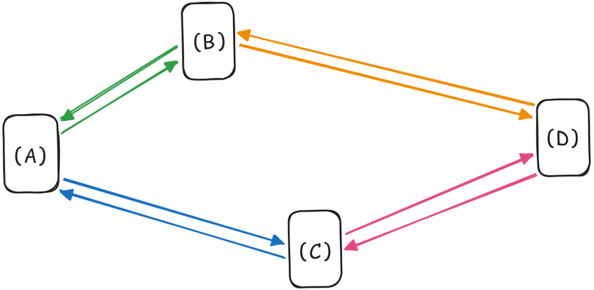
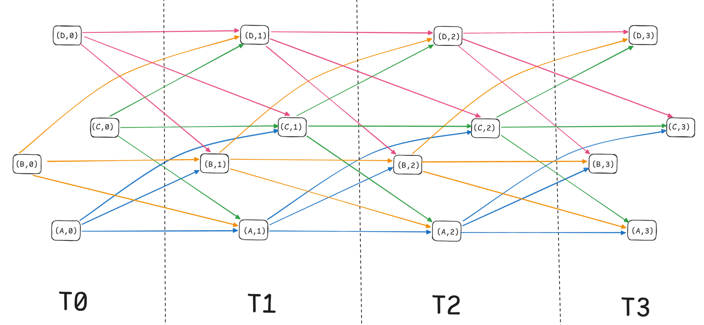

# Fly-in: Multi-Drone Routing Solver

An optimal routing system for multiple drones that uses a time-expanded graph (TEG) and a modified Dijkstra's algorithm to solve complex graph optimization problems.


## 🎯 Overview

Fly-in solves the problem of finding optimal routes for multiple drones from a starting point to a destination, respecting:

- **Connection Capacities**: Limits on the number of drones that can traverse a link simultaneously
- **Hub Capacity Constraints**: Limits on drones at each node
- **Restricted Zones**: Areas that require 2 turns to traverse (marked with drone jam icon 🔴)
- **Priority Zones**: Nodes that maximize travel efficiency (marked with star icon ⭐)

## 🔀 Simulation Workflow

### 1. Robust Map Parsing & Validation
Before the simulation begins, the project parses input files to ensure the integrity of the graph topology. This step prevents runtime crashes by validating:

* **Structural Integrity:** Ensures the existence of start/end hubs and valid drone counts.
* **Logical Consistency:** Verifies that all connections link to existing zones and that no duplicate paths exist.
* **Error Reporting:** If a configuration error is detected (e.g., syntax errors, invalid capacities), the program terminates immediately and displays a descriptive error message indicating the exact line number and cause of the failure.

*(See **Map Configuration Guide** below for strict file syntax).*

### 2. Multi-Objective Pathfinding (Modified Dijkstra)
Once the map is validated, the core engine utilizes a **Modified Dijkstra Algorithm** to determine optimal routes:
* **Primary Goal:** Minimize the total number of simulation turns.
* **Secondary Goal:** In cases where multiple paths offer the same arrival time, the algorithm selects the route that traverses the maximum number of **Priority Zones** (indicated by ⭐).

### 3. Solved via Time-Expanded Graphs (TEG)
To achieve a truly elegant and collision-free resolution, the system models the problem using **Time-Expanded Graphs** (detailed below).

### 4. Dual Display Output
The simulation provides real-time feedback through two synchronized channels:

* **Standard Terminal Output:**
    Strictly follows the required format for automated validation. Each simulation turn generates a line listing the movement of every active drone using the format:
    `D<drone_id>-<zone_name>`
    *(e.g., `D1-roof1 D2-corridorA`)*

* **Graphical Visualization (Pygame):**
    Simultaneously, a graphical window renders the simulation using **Pygame**. This allows for an intuitive visual verification of the routes, identifying congestion, and watching the drones traverse the graph in real-time.


## 🧩 Understanding Time-Expanded Graphs

### Leveraging Time-Expanded Graphs for Dynamic Pathfinding

A Time-Expanded Graph replicates each node for every possible time step and connects them to form a graph that explicitly represents time as a dimension. This elegant technique eliminates the need for intricate conditional logic when handling waiting states—waiting is simply another edge in the graph, identical to movement edges.

#### Standard Graph Example

Consider a simple network:

**Original Graph:**



In a standard graph, before moving to any node, we must strictly check if the destination node or the connecting edge will reach their capacity limits in the next turn. Furthermore, modeling "wait" actions (staying at the current node) is difficult to manage, leading to complex code with deeply nested conditions that are fragile and error-prone.

### TEG Solution

A Time-Expanded Graph creates separate nodes for each time step:

**Same Graph as TEG (3 time steps):**



Notice how:
- Each hub appears once per time step
- **Horizontal edges** are "wait" operations (staying at the same hub)
- **Diagonal edges** are movements between hubs
- Restricted zones would take 2 time steps in case they exist
- The graph structure cleanly handles all temporal dynamics without conditional logic

### TEG Advantages Over Direct Modeling

**Without TEG** (traditional approach):
```python
# Pathfinding requires manual time tracking at every step
def find_path(start, goal, current_time):
    for neighbor in graph[current_node]:
        next_time = current_time + travel_time(neighbor)

        # Must manually check capacity at FUTURE time, not current
        if hub_drones[neighbor][next_time] >= hub_capacity[neighbor]:
            continue  # Hub will be full when we arrive

        if edge_usage[current_node][neighbor][current_time] >= edge_capacity:
            continue  # Edge occupied during departure

        # Waiting requires completely separate logic branch
        if should_wait(current_node, current_time):
            # Recursive call with incremented time
            find_path(start, goal, current_time + 1)

        # Restricted zones need special duration handling
        if is_restricted(neighbor):
            next_time = current_time + 2  # Manual offset
            # Must re-check capacities for new arrival time...
```

The fundamental problem: **time is implicit**, forcing manual offset calculations everywhere. Every capacity check must reference `t+1` or `t+2` instead of the current state, and waiting/movement require different code paths.

**With TEG** (clean approach):
```python
# Standard Dijkstra - time is encoded in the graph structure
def find_path(start_node):  # start_node = (hub, t=0)
    for edge in adjacency[current_node]:
        if edge.is_traversable() and edge.target.can_enter():
            consider_path(edge.target)
```
That's it. No time arithmetic. No special cases.
 - Waiting? It's an edge from (hub, t) → (hub, t+1)
 - Movement? It's an edge from (hub_A, t) → (hub_B, t+1)
 - Restricted zone? It's an edge from (hub_A, t) → (hub_B, t+2)
 All three are structurally identical in the algorithm.


**Why this works**: Each node is `(hub, time)`, so `edge.target` already represents the destination at the correct future time. Capacity checks on `edge.target` automatically verify the right moment—no manual `t+1` offsets needed.

**Benefits realized**:
- **Elimination of intricate nested conditionals**: All actions (wait, move, traverse restricted) are uniform edges.
- **Waiting treated identically to movement**: No special handling of wait logic. Wait is just one more field in graph
- **Capacity constraints applied uniformly**: Both edges and nodes enforce capacity through shared mechanism.
- **Restricted zones implicit in structure**: 2-turn zones automatically represented through graph connectivity.
- **Reusability of standard algorithms**: Dijkstra and other graph algorithms work unchanged.
- **Explicit time dimension**: Time evolution is clear and easy to manage.

**Calculating Maximum Time Steps**
With **max_time = min_path + (nb_drones - 1)**, even the most constrained **bottleneck (1-drone capacity)** has a guaranteed solution path. With those TimeNodes and TimeEdges created, the algorithm will be able to get a shortest path if possible.

## 🎮 Pygame Visualization

The simulation runs with **dual output**: terminal text for validation and a real-time Pygame window for visual feedback.

### Visual Elements
- **Hubs**: Rendered as sprites with zone indicators (⭐ for priority, 🚫 for blocked, 🔴 for restricted)
- **Connections**: Blue lines linking connected hubs
- **Drones**: Animated sprites that smoothly interpolate between positions each turn
- **UI Overlay**: Current turn counter and simulation status

### How It Works
The `VisualSimulation` class coordinates the rendering loop to provide the mandatory visual feedback:

1. **Turn-based progression**: Each turn lasts ~1 second with smooth drone animation.
2. **Animated Drone Sprites**: Each drone utilizes a sequence of **4 unique sprites** that cycle through an animation loop. These frames are interpolated during flight to simulate propeller rotation and dynamic movement.
3. **Synchronized output**: Terminal prints movement commands (e.g., `D1-hubA`) in exact sync with the visual transitions in the Pygame window.
4. **Interpolated movement**: Drones animate smoothly between hub positions using linear interpolation (Lerp), ensuring they don't simply "teleport" between coordinates.
5. **Auto-scaling**: The window and hub sprites adapt to the map dimensions and coordinates automatically, ensuring visibility even on complex graphs.

Press `Esc` to exit the simulation at any time.

## 🚀 Quick Start

### Installation

```bash
make install
```

### Usage

In case default map wants to be simulated:
```bash
make
```

With custom map:
```bash
python3 fly-in.py <map_file>
```

### Map Format: File Constraints (.txt)
```
# 1. GLOBAL SETTINGS
# ------------------------------------------------------------------
# First Line  : Must be 'nb_drones: <number>' (positive integer).
# Comments    : Lines starting with '#' are ignored.

# 2. ZONE DEFINITIONS
# ------------------------------------------------------------------
# Prefixes    : Must define exactly one 'start_hub:', one 'end_hub:', and any number of 'hub:'.
# Syntax      : <prefix> <name> <x> <y> [metadata]
# Naming      : Unique names. Alphanumeric allowed. NO dashes (-) or spaces.
# Coordinates : Unique numeric coordinates (x, y). No duplicates allowed

# 3. ZONE METADATA (Optional, enclose in brackets [...])
# ------------------------------------------------------------------
# zone=       : normal (default), blocked, restricted, or priority.
# color=      : Any single-word string (e.g., red, blue).
# max_drones= : Positive integer (default: 1).

# 4. CONNECTIONS
# ------------------------------------------------------------------
# Prefix      : 'connection:'
# Syntax      : connection: <name1>-<name2> [metadata]
# Logic       : - Must link previously defined zones.
#               - No duplicate links allowed (a-b equals b-a).
# Metadata    : [max_link_capacity=<number>] (default: 1).
```
_Examples attached on **maps/** as well as **assets/map_sample.txt**_


## Testing

Parsing and timegraph validations have been tracked though unit testing (pytest). Attached on **tests/** folder

## 📚 Resources

### References
* [How Dijkstra's Algorithm Works](https://youtu.be/EFg3u_E6eHU?si=8rnVVytmCJ9JGVWz) by Spanning Tree
